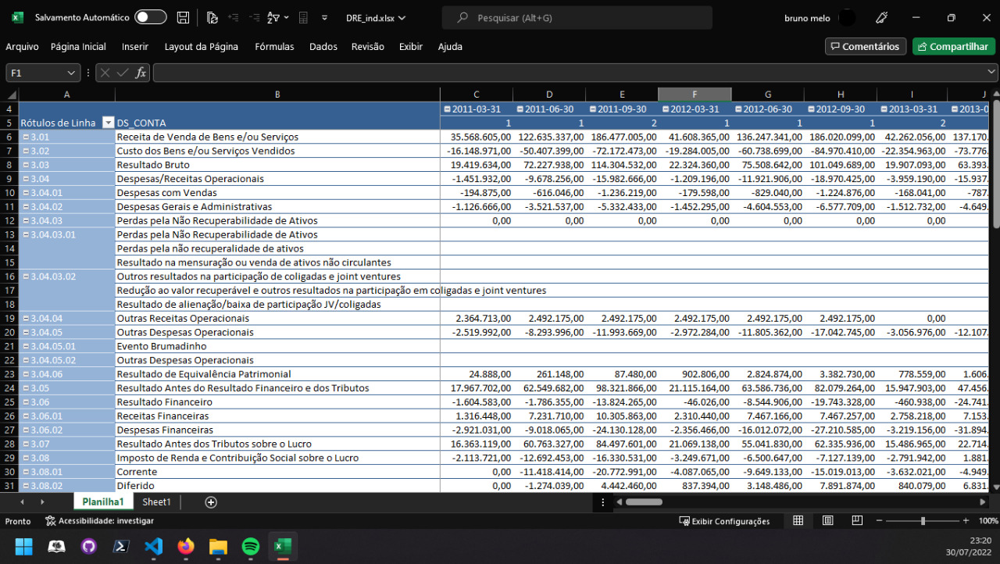

# Module Python para Coleta do Formulário de Informações Trimestrais (ITR)

## Disclaimer
Depois que eu me coloquei o desafio de fazer esse repositório, tive acesso a algumas outras iniciativas que também atuaram na mesma dificuldade. Para não cometer o erro de não dar crédito, vou listar aqui outros esforços que eu acabei encontrando após o início dessa empreitada.

1. Código Quant - Finanças Quantitativas (https://www.youtube.com/watch?v=LCMgVO1BOVQ)
2. Edufinance (https://www.youtube.com/watch?v=08zIQxZJYpc)

## Apresentação
Você já se perdeu no trabalho de atualizar suas planilhas de análise de empresas listadas em bolsa? Pois é, eu também!

O objetivo desse trabalho é facilitar a vida de quem tenta achar sentido nos demonstrativos das várias empresas listadas na B3. O trabalho ainda está em fase alpha de desenvolvimento mas já pode gerar facilidades para quem decidir usar.

O roadmap do projeto é:
- [x] Alpha com coleta de dados e salvamento de arquivo .xlsx
- [ ] Criação de um module em python com esse repositório
- [ ] Publicação do module no PIP
- [ ] Criação de interface gráfica com input de mouse

## Como usar
1. Baixe e instale o interpretador Python na sua máquina nesse [link](https://www.python.org/).
2. Baixe o repositório na sua máquina clicando no botão "Code" logo acima.
3. Execute o script main.py

### Main.py
Quando você executar o main.py terá acesso ao menu principal que contém 3 funções como na imagem abaixo

**Update na Base de Dados** é a função que baixa todos os demonstrativos disponíveis no dados.gov de 2011 até a data presente. Execute a função sempre que quiser ter certeza que seus dados estão atualizados.

**Update na Lista de Empresas** é a função que lê todos os demonstrativos e salva um arquivo .xlsx da pasta "data" com uma lista de TODAS as empresas que publicaram demonstrativos durante o período de coleta.

**Coletar um Demonstrativo** é a função principal que fez você ler esse tutorial até aqui.

### Coletar um Demonstrativo

Essa é a principal função do programa. Ao escolher a opção 3 no menu principal, você verá a seguinte mensagem:

Para saber o código CVM da empresa basta ir no link indicado na mensagem e pesquisar pela empresa desejada.

Agora que temos o código CVM da empresa (que no exemplo é a WEG), basta indicar o código no terminal e apertar enter.

Escolha o tipo de demonstrativo: Consolidado ou Individualizado.

E, finalmente, escolhe o demonstrativo que quer baixar.

Ao escolher o demonstrativo, um loading será iniciado e no final você terá um arquivo na pasta "data" com o demonstrativo compilado para todos os anos disponíveis.

### Excel

Como o projeto está em alpha, ainda não temos uma interface gráfica para análise dos dados. Então, por agora, recomendo o uso do Excel por meio do uso da tabela dinâmica para produzir um relatório como o abaixo.

# Fonte de dados

Fonte https://dados.gov.br/dataset/cia_aberta-doc-itr

O FORMULÁRIO DE INFORMAÇÕES TRIMESTRAIS (ITR) é um documento eletrônico, de encaminhamento periódico previsto no artigo 21, inciso V, da Instrução CVM nº 480/09, cujo encaminhamento à CVM deve se dar por meio do Sistema Empresas.NET.

Segundo o artigo 29 da Instrução CVM nº 480/09, o formulário ITR deverá ser preenchido com os dados das informações contábeis trimestrais elaboradas de acordo com as regras contábeis aplicáveis ao emissor, nos termos dos artigos 25 a 27 da Instrução.

O conjunto de dados disponibiliza as seguintes demonstrações financeiras entregues nos últimos cinco anos:
- Balanço Patrimonial Ativo (BPA)
- Balanço Patrimonial Passivo (BPP)
- Demonstração de Fluxo de Caixa - Método Direto (DFC-MD)
- Demonstração de Fluxo de Caixa - Método Indireto (DFC-MI)
- Demonstração das Mutações do Patrimônio Líquido (DMPL)
- Demonstração de Resultado Abrangente (DRA)
- Demonstração de Resultado (DRE)
- Demonstração de Valor Adicionado (DVA)

Nessas demonstrações, são incluídas as linhas referentes aos elencos de contas fixas e não fixas.

Além disso, o conjunto de dados disponibiliza os endereços para download dos Formulários ITR entregues no mesmo período. Para abrir os documentos baixados, é necessária a instalação do programa Empresas.NET

Os arquivos no conjunto de dados serão atualizados semanalmente com as eventuais reapresentações.
